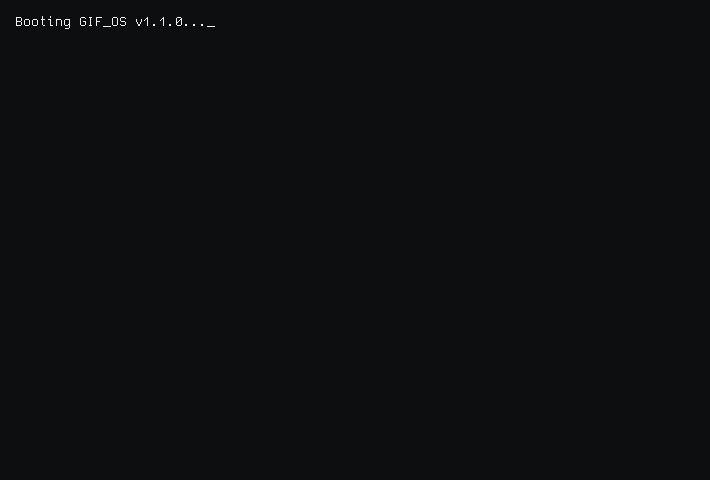
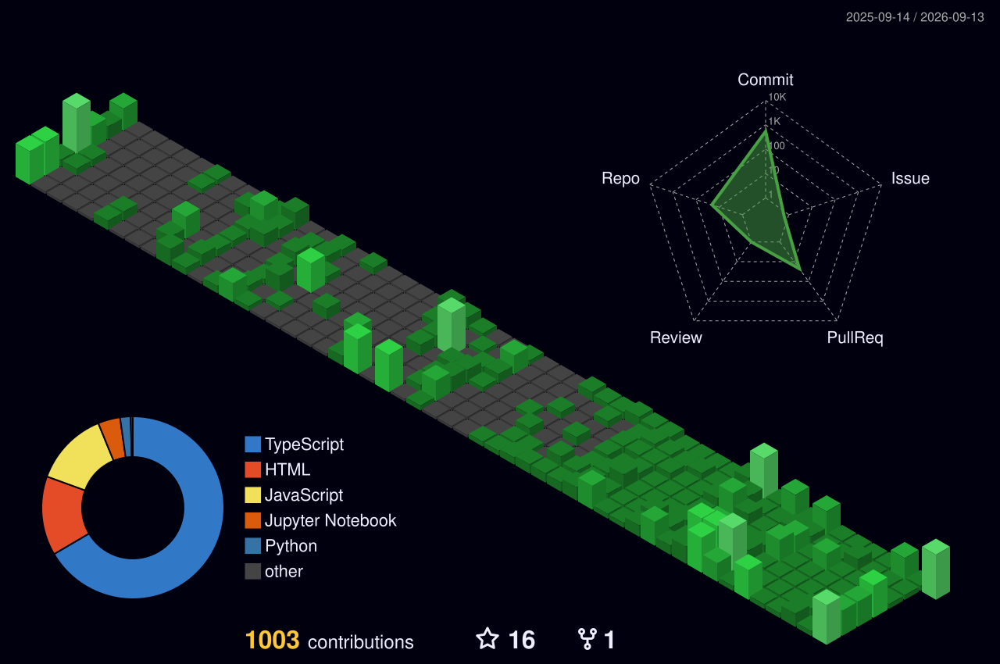

<!-- Profile README for Muhammad Awais -->

  
  
  

    <strong>Software Engineer & UX-Minded Builder</strong>
  

  

    <a href="https://portfolio.muhammadawaisweb.dev" target="_blank">🌐 Portfolio</a> •
    <a href="https://github.com/muhammad-awais-web-dev">🐙 GitHub</a> •
    <a href="https://www.linkedin.com/in/muhammad-awais-web-dev" target="_blank">💼 LinkedIn</a> •
    <a href="mailto:awaisrafique4929@gmail.com">📧 Email</a> •
    <a href="https://wa.me/923259350593" target="_blank">💬 WhatsApp</a>
  

   
  

---

## 👨‍💻 About Me

  <!-- Card 1: Focus -->
  

    <h3 style="margin-top: 0; color: #8CE95F;">🚀 Focus</h3>
    
Building highly interactive, performant, and accessible user interfaces.

  

  <!-- Card 2: Specialty -->
  

    <h3 style="margin-top: 0; color: #61DAFB;">⚙️ Specialty</h3>
    
Decoupled systems, custom React/Next.js applications, headless WordPress setups, and automated n8n backend pipelines.

  

  <!-- Card 3: Education & Certs -->
  

    <h3 style="margin-top: 0; color: #FFAD1F;">🎓 Certifications</h3>
    
Meta Full-Stack & Front-End Specializations, Google UX Design, and AI Prompting Essentials.

  

  <!-- Card 4: Philosophy -->
  

    <h3 style="margin-top: 0; color: #E95F8C;">💡 Philosophy</h3>
    
Translating real-world user requirements into clean, structured code and delightful user journeys.

  

---

## 🛠 Tech Stack & Tools

### 🌐 Front-End

### ⚙️ Back-End & CMS

### 🎨 Design & Workflow

---

## 🏆 Certifications

  <table border="0">
    <tr>
      <td>
        
      </td>
      <td>
        
      </td>
      <td>
        
      </td>
    </tr>
    <tr align="center">
      <td><strong>Meta Full-Stack</strong></td>
      <td><strong>Meta Front-End</strong></td>
      <td><strong>Google UX Design</strong></td>
    </tr>
    <tr>
      <td>
        
      </td>
      <td>
        
      </td>
      <td>
        
      </td>
    </tr>
    <tr align="center">
      <td><strong>Meta Back-End</strong></td>
      <td><strong>AI Prompting</strong></td>
      <td><strong>IBM JS & React</strong></td>
    </tr>
  </table>
  
   
  <a href="https://www.credly.com/users/muhammad-awais-web-dev" target="_blank">🎓 Credly Profile 🔗</a> • 
  <a href="https://www.coursera.org/learner/muhammad-awais-web-dev" target="_blank">✏️ Coursera Profile 🔗</a>

---

## 📊 GitHub Analytics

<h3 align="center">3D Contributions</h3>

  

  
    
  
  <table border="0">
    <tr>
      <td width="50%" align="center">
        
      </td>
      <td width="50%" align="center">
        
      </td>
    </tr>
    <tr>
      <td colspan="2" align="center">
        
      </td>
    </tr>
  </table>

---

## 📞 Let's Connect!

  <a href="https://www.linkedin.com/in/muhammad-awais-web-dev" target="_blank" style="text-decoration: none;">
    

      
      LinkedIn
    

  </a>
  <a href="mailto:awaisrafique4929@gmail.com" style="text-decoration: none;">
    

      
      Email
    

  </a>
  <a href="https://wa.me/923259350593" target="_blank" style="text-decoration: none;">
    

      
      WhatsApp
    

  </a>
  <a href="https://portfolio.muhammadawaisweb.dev" target="_blank" style="text-decoration: none;">
    

      
      Portfolio
    

  </a>

